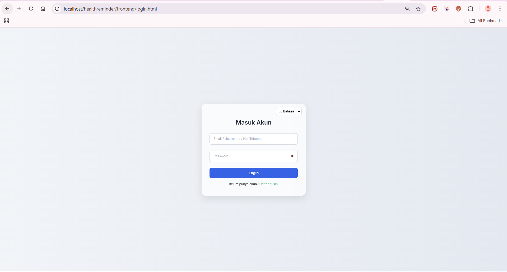
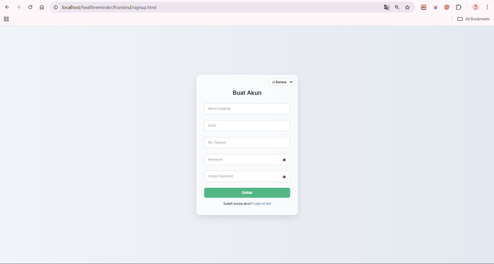
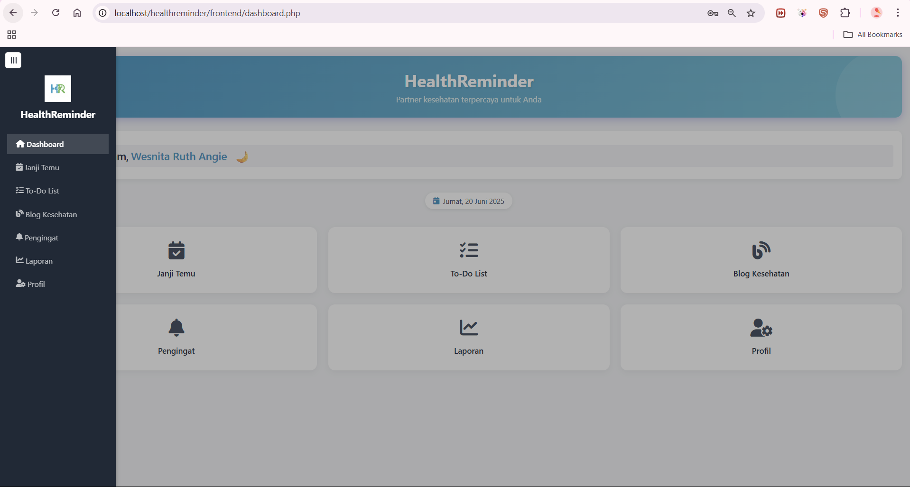
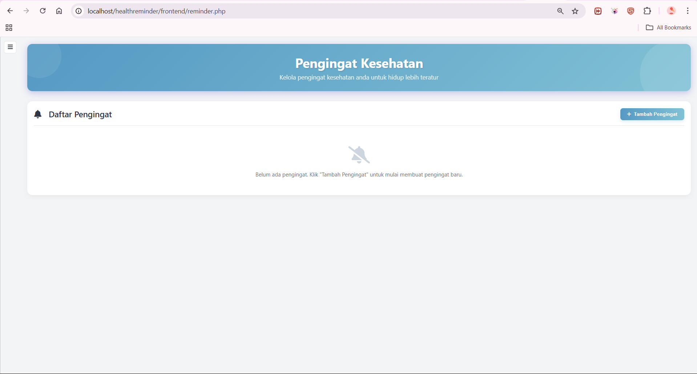
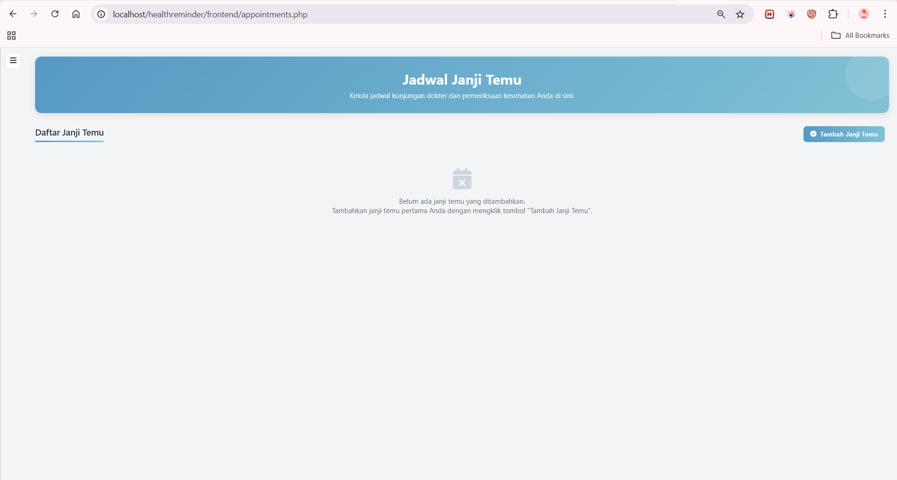
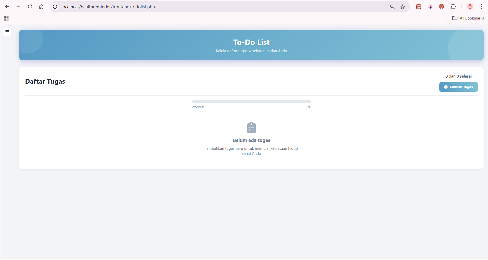
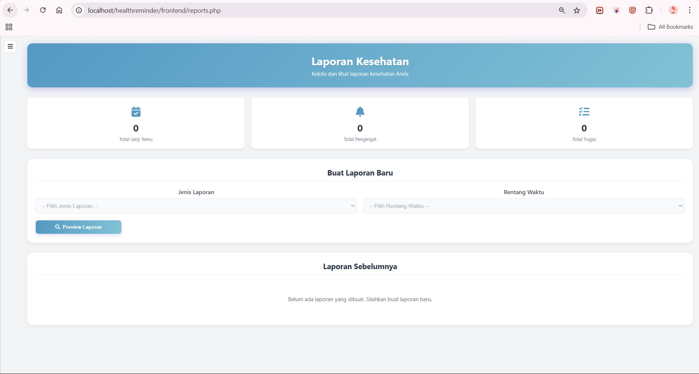
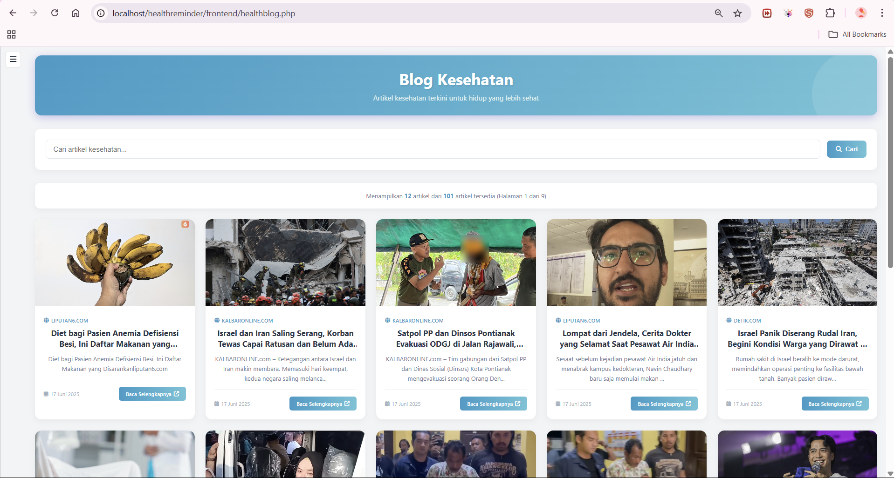
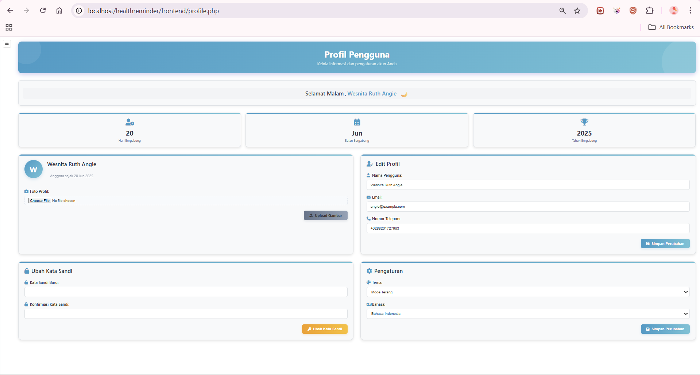
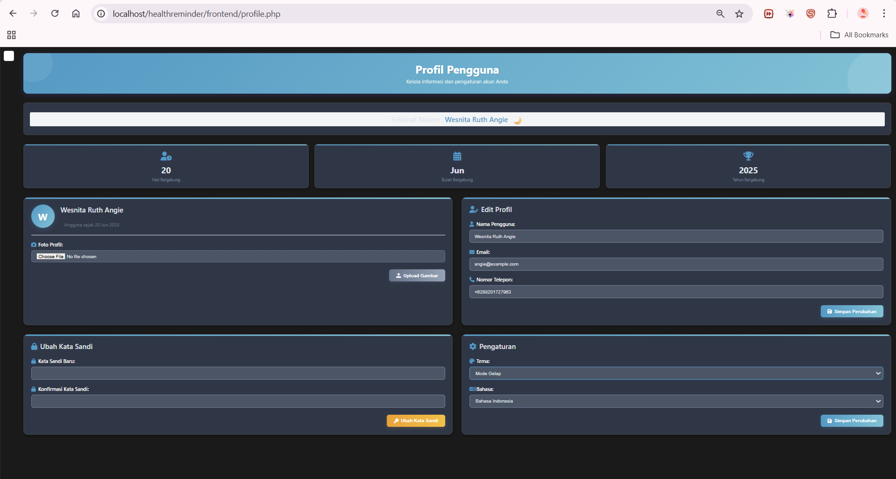

# 💖 My Little Health Buddy\! 🌿✨

Hello, health champions\! ✨ Ever wished you had a tiny, adorable friend whispering gentle reminders to help you stay healthy? Welcome to **My Little Health Buddy\!**, a charming web application designed to be your personal assistant for a healthier, happier life\! 🏡💖

This app is your cozy corner for managing everything from daily reminders to doctor's appointments, all wrapped up in a user-friendly package. We're currently **100% complete** on this journey to make wellness fun and easy\! 🚀

-----

## ✨ What Sweet Nudges Will It Give?

  * **Your Personal Health Profile:** Register, log in, and customize your experience\! Choose your favorite language and theme (bright or cozy dark mode) to make your health journey truly yours. 🌈
  * **Gentle Reminders:** Never miss a pill or a vital health task again\! Our buddy sends timely notifications for medicine and appointments. Psst... it even supports **SMS notifications** to tap you on the shoulder directly\! 🔔📱
  * **Appointment Manager:** Keep all your medical schedules neatly organized. No more missed check-ups\! 🗓️🩺
  * **Daily To-Do Lists:** Beyond reminders, manage your daily health-related activities, from exercise goals to meal prep. ✅🏃‍♀️
  * **Health Progress Reports:** Get a bird's-eye view of your health journey\! Generate lovely PDF summaries of your health logs to track your progress. 📈📄
  * **Wellness Wisdom Blog:** Dive into a collection of helpful articles and educational content to keep your mind as healthy as your body\! 🧠💡

-----

## 🛠️ What Makes Our Buddy Tick?

  * **Frontend Magic:** HTML, CSS, JavaScript (The pretty face and lively interactions\!)
  * **Backend Brains:** PHP (The smart engine behind the scenes\!)
  * **Database Heart:** MySQL (Where all your precious health data safely rests\!)
  * **PDF Spells:** Uses a library to generate those neat PDF reports.
  * **SMS Whispers:** Integrates with a service to send those helpful SMS notifications.

-----

## 📂 Peek Inside Our Health Home (Project Structure)

```
healthreminder/
├── backend/               # The brain of our app (PHP logic)
├── database/              # Where the database connection and setup scripts reside
├── frontend/              # The pretty face of our app (HTML, CSS, JS files)
├── img/                   # A folder for general images used in the app
├── screenshot/            # Our delightful photo album of the app's moments!
├── healthreminder.sql     # The blueprint for our MySQL database
└── .gitignore             # The little helper that keeps unwanted files out of GitHub
```

-----

## 🚀 How to Welcome Your Buddy Home (Installation & Setup)

Ready to bring your Health Buddy to life on your computer? Follow these cozy steps:

1.  **Clone the Repository:**

    ```bash
    git clone https://github.com/njhereee/Health-Reminder-App.git
    cd Health-Reminder-App # Or whatever your repo name is!
    ```

2.  **Set Up Your Web Server (XAMPP/LAMP/MAMP/WAMP):**

      * Make sure your local server (Apache and MySQL) is up and humming.
      * Place the `healthreminder` folder directly into your XAMPP's `htdocs` directory.

3.  **Database Heartbeat:**

      * Open phpMyAdmin (usually `http://localhost/phpmyadmin/`).
      * Create a new database (e.g., `healthreminder`).
      * Import the `healthreminder.sql` file into your new database. This will set up all the necessary tables (users, reminders, appointments, todos, reports, blog\_posts, user\_settings).
      * **Important:** Ensure your database connection settings in your PHP backend files are correctly pointing to this new database (e.g., `user='root'`, `pass=''`, `db='healthreminder'`).

4.  **Backend Dependencies (if any):**

      * If your backend uses Composer for PHP dependencies (like a PDF library or SMS gateway client), navigate to the `backend/` folder in your terminal and run `composer install`. (If not, you can skip this step\!)

5.  **Access Your Buddy\!**

      * Open your web browser and visit: `http://localhost/healthreminder/` (or `http://localhost/healthreminder/login.php` if it starts with a login page).

-----

## 🌈 How to Play with Your Buddy\!

  * **Sign Up/Log In:** Create your health profile.
  * **Dashboard:** See your daily overview and quick stats.
  * **Reminders:** Set up new nudges for medicine, hydration, or breaks.
  * **Appointments:** Manage your medical visits.
  * **To-Do List:** Keep track of your health-related tasks.
  * **Reports:** Generate summaries of your activities.
  * **Health Blog:** Read insightful articles.
  * **Switch Theme:** Toggle between light and dark modes\!

-----

## 💖 Credits

  * **Developed by:** Angie (aka njhereee) & Group Members (If you want to list them, add here\!)
  * **Inspired by:** The simple joy of staying healthy\! 🍎🧘‍♀️

-----

## 🤝 Join Our Health Journey (Contribution)

We'd love for you to join\! Feel free to **fork** this repository and **submit pull requests** with new ideas or improvements. Let's make wellness even more delightful\!

-----

## ⚖️ License

This project is licensed under the **MIT License**.

-----

### 📸 Moments with My Health Buddy (Screenshots)

Here are some sweet glimpses of our application in action: 🏡💖


*Your warm welcome to the Health Buddy app, ready to begin your wellness journey. 🔑*


*Where new health champions create their personal health profile! ✍️*


*Your daily health command center, offering quick insights and an overview of your well-being. 🏠✨*


*Another delightful perspective of your personalized health dashboard, showing more details. 📊*


*Setting up gentle nudges for your health tasks—never miss a beat! ⏰🔔*


*Keeping track of all your important medical visits and schedules. 🗓️🩺*


*Your personal checklist for staying on top of daily health activities. ✅🏃‍♀️*


*Generating insightful summaries and progress reports of your health journey. 📈📄*


*Discovering wisdom and tips for a healthier lifestyle through engaging articles. 🧠💡*


*Your personal space to manage settings, preferences, and personal details. 👤⚙️*


*Embrace the calm with our cozy dark theme—perfect for winding down! 🌙✨*
